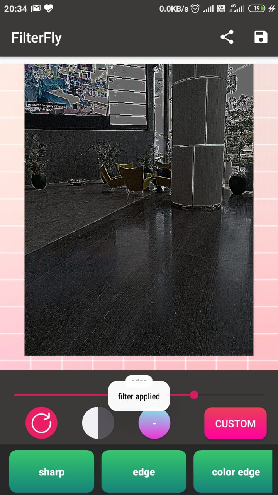

# FilterFly

## App Description

This app uses simple 2D Filters to implement blur, sharpening, edge detection etc. along with some simple color filters andallows the creation of custom 2d image filters. It has been built as an Android app and written using multi threading in Java to improve performance and responsiveness.
  

## App Views

  
  
  
  
  

 

## Internal Working

### Convolution: 
The app uses Image convolution to apply 2D filters on images. There are a lot of predefined filters such as **sobel, gaussian, laplacian filters** etc, it consists of taking an odd sized matrix and using it to calculate the value of each individual pixel by also taking into consideration its neighbourhood pixel values. The size of the neighbourhood and the weightage given to each pixel is specified by the 2d matrix filter.

A simple **identity 3x3 filter** would be one which does not take into consideration any neighbourhood pixels
$$\begin{pmatrix} 0 & 0 & 0 \\0 & 1 & 0\\0 & 0 & 0 \end{pmatrix}$$

A **gaussian blurring filter** takes into account the neighbourhood pixels and weights them based on distance
$$\frac{1}{16} \begin{pmatrix} 1 & 2 & 1 \\2 & 4 & 2\\1 & 2 & 1 \end{pmatrix}$$

Using the slider with values between 1 to 100 we can use basic linear interpolation to get an intermediary effect for the filter.

For eg, consider applying the above gaussian filter. At value 0 we have our *identity matrix*, at 100 the *gaussian*, any intermediate value like 50 will lead to an *weaker blur*

#### slider value:
0 -> 50 -> 100
$$\begin{pmatrix} 0 & 0 & 0 \\0 & 1 & 0\\0 & 0 & 0 \end{pmatrix} \rightarrow \frac{1}{8}\begin{pmatrix} 0.5 & 1 & 0.5 \\1 & 2 & 1\\0.5 & 1 & 0.5 \end{pmatrix} \rightarrow \frac{1}{16} \begin{pmatrix} 1 & 2 & 1 \\2 & 4 & 2\\1 & 2 & 1 \end{pmatrix}$$

### Implementation: 

Since image sizes can be very large, we first compress the image to smaller dimensions. Since convolution is applied on each pixel on each of the **R G B** channels, it is a very heavy operation, this cant be done directly on Android's UI thread as it will make the app UI unresponsive unable to render, so we proceed to use Multi Threading using the **Runnable Interface**. Any UI operations required will be handled over to the **Handler Thread**
  

